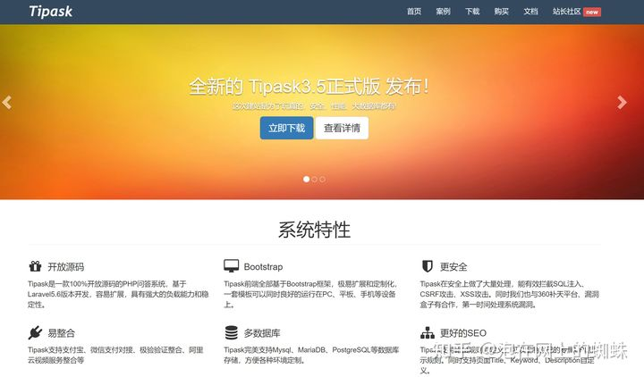
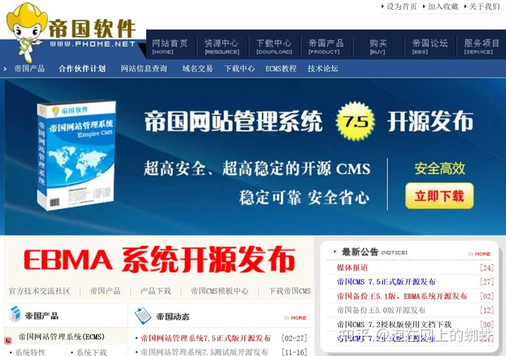
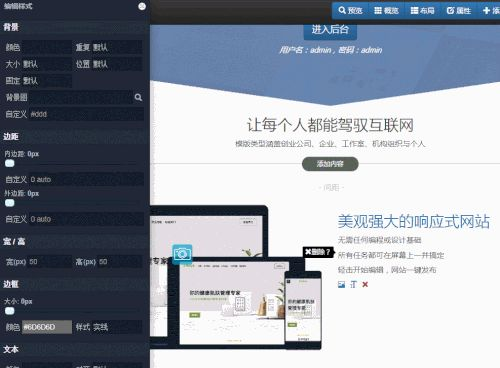

# 国内外开源免费的建站CMS有哪些？ #

作者：Gitee
链接：https://www.zhihu.com/question/36861553/answer/256745995
来源：知乎
著作权归作者所有。商业转载请联系作者获得授权，非商业转载请注明出处。

谢邀，国内比较优秀的 CMS 建站系统在此推荐一波，可能比较杂，可以有选择性的看一下，也供大家就交流学习。

## 1.项目名称：Java快速开发平台 MCMS ##

项目简介：完整开源，Java快速开发平台。基于Spring、SpringMVC、Mybatis架构，MStore提供更多好用的插件与模板（文章、商城、微信、论坛、会员、评论、支付、积分、工作流、任务调度等，同时提供上百套免费模板任意选择），价值源自分享！铭飞系统不仅一套简单好用的开源系统、更是一整套优质的开源生态内容体系。铭飞的使命就是降低开发成本提高开发效率，提供全方位的企业级开发解决方案，每月28定期更新版本。

项目地址：[铭飞/MCMS - 码云 Gitee.com2.](https://link.zhihu.com/?target=https%3A//gitee.com/mingSoft/MCMS)  

## 2.项目名称：信息咨询 Jfinal CMS ##

项目简介：Ffinal CMS 是一个java开发的功能强大的信息咨询网站，采用了简洁强大的JFinal作为web框架，模板引擎用的是beetl，数据库用mysql，前端bootstrap框架。 支持oauth2认证、帐号注册、密码加密、评论及回复，消息提示，网站访问量统计，文章评论数和浏览量统计，回复管理，支持权限管理。 后台模块包含：栏目管理，栏目公告，栏目滚动图片，文章管理，回复管理，意见反馈，我的相册，相册管理，图片管理，专辑管理、视频管理、缓存更新，友情链接，访问统计，联系人管理，模板管理，组织机构管理，用户管理，角色管理，菜单管理，数据字典管理。

项目地址：[Fly的狐狸/jfinal_cms - 码云 Gitee.com3](https://link.zhihu.com/?target=https%3A//gitee.com/flyfox/jfinal_cms).  

## 3.项目名称：PublicCMS ##

项目简介：PublicCMS是采用2017年最新主流技术开发的免费开源JAVACMS系统。架构科学，轻松支持上千万数据、千万PV；支持全站静态化，SSI，动态页面局部静态化等为您快速建站，建设大规模站点提供强大驱动，也是企业级项目产品原型的良好选择。

项目地址：[kerneler/PublicCMS - 码云 Gitee.com4.  ](https://link.zhihu.com/?target=https%3A//gitee.com/sanluan/PublicCMS)

## 4.项目名称：电子商务平台及CMS建站系统 CmsWing ##

项目简介：一款基于ThinkJS(Node.js MVC)和MySQL的功能强大的（PC端,手机端和微信公众平台）电子商务平台及CMS建站系统。

- 模块化：全新的架构和模块化的开发机制，便于灵活扩展和二次开发。
- 模型/栏目/分类信息体系：通过栏目和模型绑定，以及不同的模型类型，不同栏目可以实现差异化的功能，轻松实现诸如资讯、下载、讨论和图片等功能。通过分类信息和栏目绑定，可以自动建立索引表，轻松实现复杂的信息检索。
- 用户行为：支持自定义用户行为，可以对单个用户或者群体用户的行为进行记录及分享，为您的运营决策提供有效参考数据。
- 云服务支持：支持云存储、云安全、云过滤和云统计等服务，更多贴心的服务让您的网站更安心。
- 安全稳健：提供稳健的安全策略，包括备份恢复、容错、防止恶意攻击登录，网页防篡改等多项安全管理功能，保证系统安全，可靠、稳定的运行。

项目地址：[阿特/CmsWing - 码云 Gitee.com5.  ](https://link.zhihu.com/?target=https%3A//gitee.com/sanluan/PublicCMS)

## 5.项目名称：DoraCMS ##

项目简介：DoraCMS是基于Nodejs+express+mongodb编写的一套内容管理系统，结构简单，较目前一些开源的cms，doracms易于拓展，特别适合前端开发工程师做二次开发。

项目地址：[doramart/DoraCMS - 码云 Gitee.com](https://link.zhihu.com/?target=https%3A//gitee.com/doramart/DoraCMS)

来码云 http://Gitee.com

发现更多优质开源项目：最新推荐 - 码云 - 开源中国

让团队流畅、高效开发：码云企业版 - 码云 - 开源中国

国外的，[softculous](https://www.softaculous.com/apps)的apps列表是一个很好的参考，对不同类型网站最常用的建站系统都分了类：博客 / 信息门户 / 论坛 / 维基系统 / 电商 等。

https://www.softaculous.com/apps

需要指出的是，WordPress，Joomla，Drupal等通用的建站系统，应用领域并不限定在博客或门户网站，这些系统经过很多年的迭代，早已进化成可以应付多种建站场景的多面手了。

答Catfish(鲶鱼) CMS开源免费可商用，使用还简单

发布于 2018-07-26 23:13

多年经验总结大致分为以下几类：

## 1、博客/日志/问答、 ##

Z-Blog、typecho、tipask、hexo

## 2、BBS/论坛/社区 ##

discuz、opensns、PHPWind、phpbb

## 3、CMS/内容管理 ##

帝国CMS、织梦Dedecms、PageAdmin、joomla、destoon

## 4、Shop/电商购物 ##

ECshop、shopeX

现在大家用的多一点的一般是：

**博客：Wordpress**

**问答：tipask**

**论坛 discuz**

**内容CMS 帝国CMS**

**电商购物 ECshop ShopeX**

**纸壳CMS**

开源免费，可视化设计，在线编辑

**SeriaWei/ZKEACMS.Core**

​github.com/SeriaWei/ZKEACMS.Core

